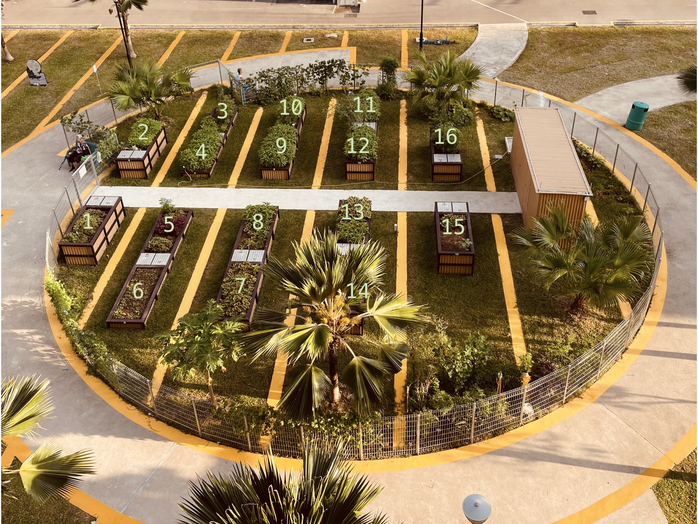

Eunos Crescent Community Garden
===============================

| Location | Plants |
| -------- | ------ |
| Plot 1   | Mugwort (Ai Cao), Red Bayam |
| Fence beside 1 | Pumpkin |
| Plot 2   | Green Bayam, Rock Melon |
| Plot 2 behind palm tree | Chilli, Kai Lan, Laksa, Rock Melon, Passionfruit |
| Plot 3   | Green Bayam, Tomato |
| Fence beside 3 | Rock Melon, Papaya, Passionfruit |
| Plot 4   | Green Bayam, Sweet Pepper |
| Fence behind shed | Cucumber, Eggplant(?), Green Beans, Pandan, Passionfruit, Papaya, Pumpkin, Rock Melon |
| Plot 5   | Devil's Chilli, Red Amaranth, Red Bayam |
| Plot 6   | Cai Xin |
| Fence beside 6 | Green Bittergourd, White Bittergourd, Winged Beans, Roselle, Indian Borage, Avocado(?) |
| Plot 7   | Red Bayam |
| Fence beside 7 | Papaya |
| Fence beside 7 | Ginger, Tumeric |
| Plot 8   | Curry, Limau Kasturi (calamansi), Red Bayam |
| Plot 9   | Green Bayam |
| Plot 10  | Green Bayam, Nai Bai, Tomato, Green Peas |
| Fence beside 10 | Rock Melon, Basil, Curry, Laksa, Cucumber, Blue Pea |
| Fence near 10 behind palm tree | Sweet Basil |
| Plot 11  | Ginger, Green Bayam |
| Plot 12  | Green Bayam, Basil, Rosemary, Tomato |
| Fence beside 15 | Bittergourd, Chilli, Longan, Mulberry, Papaya, Rhoeo (Ang Tek Heok), Soursoup, Tomato |
| Plot 13  | Red Bayam |
| Plot 14  | Red Bayam |
| Plot 15  | Red Bayam |
| Plot 16  | Green Bayam, Chilli, Tomato |
